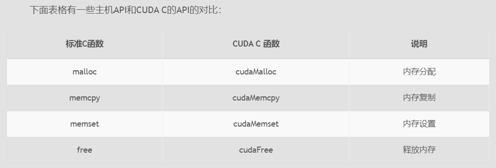
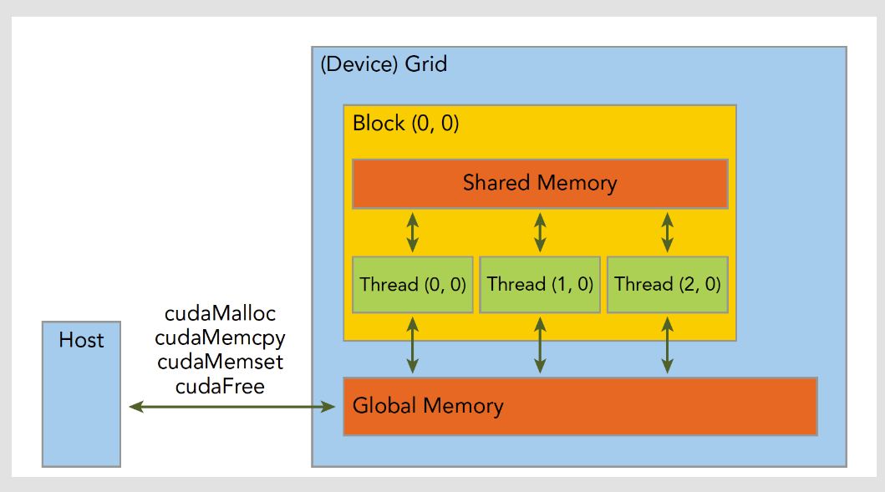
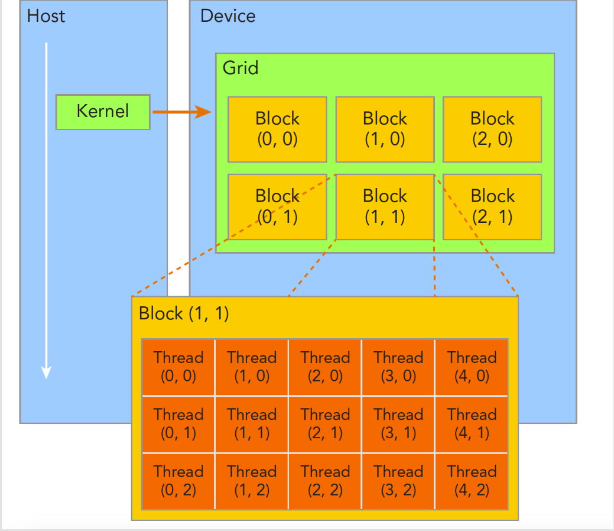
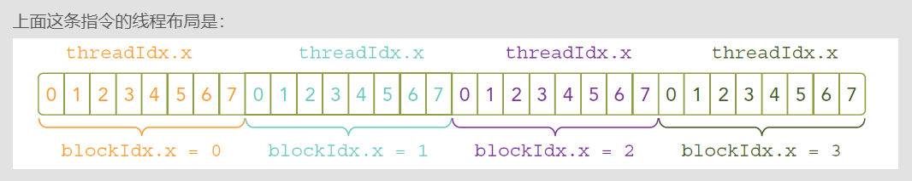
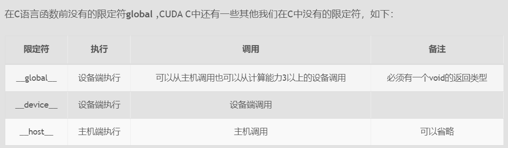
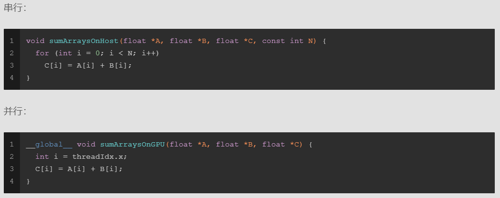

主机API和CUDA C的内存管理函数区别：



GPU的内存分层结构：



## **线程管理：**
当内核函数开始执行，如何组织GPU的线程就变成了最主要的问题了，我们必须明确，一个核函数只能有一个grid，一个grid可以有很多个block，每个block可以有很多的线程，这种分层的组织结构使得我们的并行过程更加自如灵活：


一个线程块block中的线程可以完成下述协作：同步、共享内存

接下来就是给每个线程一个编号了，我们知道每个线程都执行同样的一段串行代码，那么怎么让这段相同的代码对应不同的数据呢？首先第一步就是让这些线程彼此区分开，才能对应到相应从线程，使得这些线程也能区分自己的数据。如果线程本身没有任何标记，那么没办法确认其行为。依靠下面两个内置结构体确定线程标号：
- blockIdx（线程块在线程网格内的位置索引）
- threadIdx（线程在线程块内的位置索引）

这两个内置结构体基于 uint3 定义，包含三个无符号整数的结构x, y, z

当然我们要有同样对应的两个结构体来保存其范围，也就是blockIdx中三个字段的范围threadIdx中三个字段的范围：他们也是包含三个成员x，y，z
- blockDim
- gridDim

注意：dim3是手工定义的，主机端可见。uint3是设备端在执行的时候可见的，不可以在核函数运行时修改，初始化完成后uint3值就不变了。他们是有区别的！这一点必须要注意。


## **关于核函数**

核函数就是在CUDA模型上诸多线程中运行的那段串行代码，这段代码在设备上运行，用NVCC编译，产生的机器码是GPU的机器码，所以我们写CUDA程序就是写核函数，第一步我们要确保核函数能正确的运行产生正切的结果，第二优化CUDA程序的部分，无论是优化算法，还是调整内存结构，线程结构都是要调整核函数内的代码，来完成这些优化的。

- 启动核函数的指令：kernel_name<<<grid,block>>>(argument list); 这里<<<>>>用来指定设备的线程结构配置

    通过指定grid和block的维度，我们可以配置：
        内核中线程的数目
        内核中使用的线程布局
    我们可以使用dim3类型的grid维度和block维度配置内核，也可以使用int类型的变量，或者常量直接初始化:`kernel_name<<<4,8>>>(argument list)`;

    

    上面这些是启动部分，当主机启动了核函数，控制权马上回到主机，而不是主机等待设备完成核函数的运行

    想要主机等待设备端执行可以用下面这个指令：`cudaError_t cudaDeviceSynchronize(void);`

    关于核函数的一些关键字限定词，与标准C语言有些不同：
    

    - **Kernel核函数编写有以下限制**
        - 只能访问设备内存
        - 必须有void返回类型
        - 不支持可变数量的参数
        - 不支持静态变量
        - 显示异步行为

    <font color='red'>**并行程序中经常的一种现象：把串行代码并行化时对串行代码块for的操作，也就是把for并行化，可以看到不需要写for循环了**</font>

    

    CUDA小技巧，当我们进行调试的时候可以把核函数配置成单线程的：`kernel_name<<<1,1>>>(argument list)`

## **错误处理**

- 例如代码库里头文件中的宏：

    ```c++
    #define CHECK(call)\
    {\
        const cudaError_t error=call;\
        if(error!=cudaSuccess)\
        {\
            printf("ERROR: %s:%d,",__FILE__,__LINE__);\
            printf("code:%d,reason:%s\n",error,cudaGetErrorString(error));\
            exit(1);\
        }\
    }
    /*
    获得每个函数执行后的返回结果，然后对不成功的信息加以处理，CUDA C 的API每个调用都会返回一个错误代码，这个代码我们就可以好好利用了，当然在release版本中可以去除这部分，但是开发的时候一定要有的
    */
    ```
