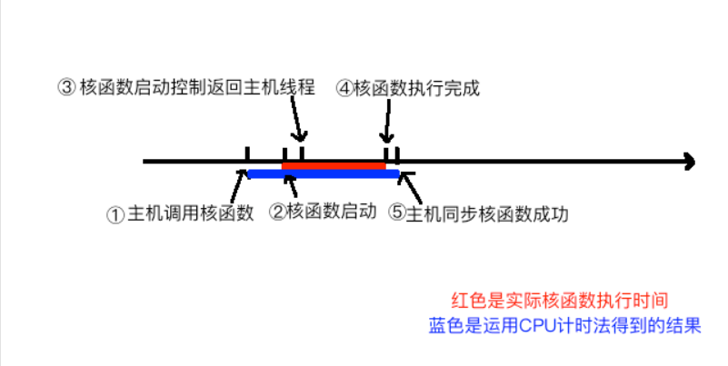
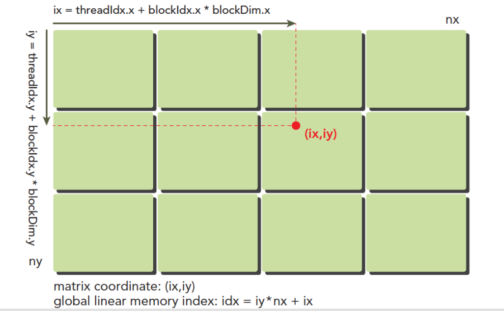

主机API和CUDA C的内存管理函数区别：


GPU的内存分层结构：


## **线程管理：**
当内核函数开始执行，如何组织GPU的线程就变成了最主要的问题了，我们必须明确，一个核函数只能有一个grid，一个grid可以有很多个block，每个block可以有很多的线程，这种分层的组织结构使得我们的并行过程更加自如灵活：


一个线程块block中的线程可以完成下述协作：同步、共享内存

接下来就是给每个线程一个编号了，我们知道每个线程都执行同样的一段串行代码，那么怎么让这段相同的代码对应不同的数据呢？首先第一步就是让这些线程彼此区分开，才能对应到相应从线程，使得这些线程也能区分自己的数据。如果线程本身没有任何标记，那么没办法确认其行为。依靠下面两个内置结构体确定线程标号：
- blockIdx（线程块在线程网格内的位置索引）
- threadIdx（线程在线程块内的位置索引）

这两个内置结构体基于 uint3 定义，包含三个无符号整数的结构x, y, z

当然我们要有同样对应的两个结构体来保存其范围，也就是blockIdx中三个字段的范围threadIdx中三个字段的范围：他们也是包含三个成员x，y，z
- blockDim
- gridDim

注意：dim3是手工定义的，主机端可见。uint3是设备端在执行的时候可见的，不可以在核函数运行时修改，初始化完成后uint3值就不变了。他们是有区别的！这一点必须要注意。


## **关于核函数**

核函数就是在CUDA模型上诸多线程中运行的那段串行代码，这段代码在设备上运行，用NVCC编译，产生的机器码是GPU的机器码，所以我们写CUDA程序就是写核函数，第一步我们要确保核函数能正确的运行产生正切的结果，第二优化CUDA程序的部分，无论是优化算法，还是调整内存结构，线程结构都是要调整核函数内的代码，来完成这些优化的。

- 启动核函数的指令：kernel_name<<<grid,block>>>(argument list); 这里<<<>>>用来指定设备的线程结构配置

    通过指定grid和block的维度，我们可以配置：
        内核中线程的数目
        内核中使用的线程布局
    我们可以使用dim3类型的grid维度和block维度配置内核，也可以使用int类型的变量，或者常量直接初始化:`kernel_name<<<4,8>>>(argument list)`;

    

    上面这些是启动部分，当主机启动了核函数，控制权马上回到主机，而不是主机等待设备完成核函数的运行

    想要主机等待设备端执行可以用下面这个指令：`cudaError_t cudaDeviceSynchronize(void);`

    关于核函数的一些关键字限定词，与标准C语言有些不同：
    

    - **Kernel核函数编写有以下限制**
        - 只能访问设备内存
        - 必须有void返回类型
        - 不支持可变数量的参数
        - 不支持静态变量
        - 显示异步行为

    <font color='red'>**并行程序中经常的一种现象：把串行代码并行化时对串行代码块for的操作，也就是把for并行化，可以看到不需要写for循环了**</font>

    

    CUDA小技巧，当我们进行调试的时候可以把核函数配置成单线程的：`kernel_name<<<1,1>>>(argument list)`

## **错误处理**

- 例如代码库里头文件中的宏：

    ```c++
    #define CHECK(call)\
    {\
        const cudaError_t error=call;\
        if(error!=cudaSuccess)\
        {\
            printf("ERROR: %s:%d,",__FILE__,__LINE__);\
            printf("code:%d,reason:%s\n",error,cudaGetErrorString(error));\
            exit(1);\
        }\
    }
    /*
    获得每个函数执行后的返回结果，然后对不成功的信息加以处理，CUDA C 的API每个调用都会返回一个错误代码，这个代码我们就可以好好利用了，当然在release版本中可以去除这部分，但是开发的时候一定要有的
    */
    ```

## **给核函数计时**

- 用CPU计时：详情见sum_array_timer文件

    - 使用gettimeofday函数是linux下自带的一个库函数，创建cpu计时
        ```c++
        #include <sys/time.h>
        double cpuSecond()
        {
        struct timeval tp;
        gettimeofday(&tp,NULL);
        return((double)tp.tv_sec+(double)tp.tv_usec*1e-6);
        }
        ```

    大致测试时间流程如下图：
    

- 更准确的方式应当使用nvprof计时，cuda5.0之后支持，用法为`nvprof [nvprof_args] <application>[application_args]`


## **CUDA模型中的线程组织模式：Thread,Block,Grid**

- 使用块和线程建立矩阵索引，一个基本的线程模型如下图：

    
    这里(ix,iy)就是整个线程模型中任意一个线程的索引，或者叫做全局地址，局部地址当然就是(threadIdx.x,threadIdx.y)了，不同线程块中有相同的局部索引值

    我们要做管理的就是：
    - 线程和块索引（来计算线程的全局索引）
    - 矩阵中给定点的坐标（ix,iy）
    - (ix,iy)对应的线性内存的位置

    <font color='red'>**线程的坐标(ix,iy)对应矩阵中(ix,iy)的元素，这样就形成了一一对应，不同的线程处理矩阵中不同的数据，举个具体的例子，ix=10,iy=10的线程去处理矩阵中(10,10)的数据**</font>

    具体实验代码见：`thread_idx.cu`和`sum_matrix.cu`